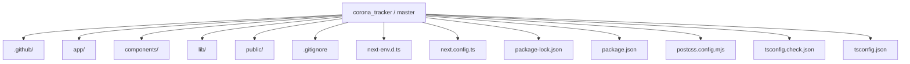
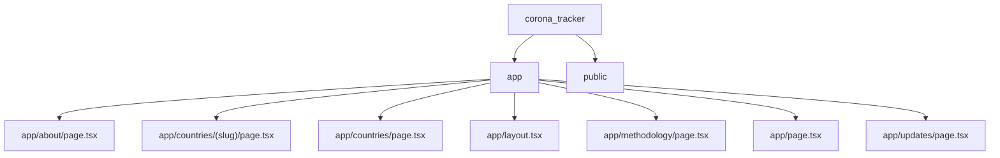
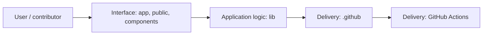
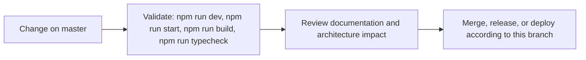

# PulseAtlas

<!-- interactive-readme-standard:start -->

> [!NOTE]
> **Branch-specific documentation:** this section is maintained for [`master`](https://github.com/Nischhalsubba/corona_tracker/tree/master). It is generated from the files present on this branch and preserves the project-authored README below.

<details open>
<summary><strong>Interactive repository guide</strong></summary>

## Branch overview

| Item | Value |
|---|---|
| Repository | [`Nischhalsubba/corona_tracker`](https://github.com/Nischhalsubba/corona_tracker) |
| Branch | [`master`](https://github.com/Nischhalsubba/corona_tracker/tree/master) |
| Detected stack | Next.js, React, Tailwind CSS, TypeScript, JavaScript, CSS |
| Detected manifests | package.json |
| Documentation policy | Every maintained branch must explain purpose, setup, structure, architecture, flows, testing, delivery, security, and ownership. |

## Repository structure



The diagram is generated from the branch's actual top-level files and directories. Use the branch link above for complete source navigation.

## Website or application structure



## Application and responsibility flow



## Change-to-delivery flow



## README requirements for this branch

- Explain what this branch contains and how it differs from the default branch.
- Keep installation, configuration, usage, testing, deployment, security, support, and license information accurate.
- Document repository, website or application, API, data, authentication, background-job, and deployment flows when they exist.
- Prefer Mermaid diagrams and expandable `<details>` sections for visual navigation.
- Link diagrams and modules to real source paths; never invent missing components.
- Preserve project-specific documentation and update diagrams whenever architecture or major paths change.
- Treat secrets, private infrastructure, customer data, and credentials as prohibited README content.

</details>

<!-- interactive-readme-standard:end -->

PulseAtlas is a public-facing COVID-19 reporting dashboard built with Next.js App Router and TypeScript. It is designed as a source-aware health data product rather than a thin wrapper around a single endpoint, combining live disease.sh reporting with WHO, OWID, and DataHub reference layers through a normalized internal data model.

## What this repo includes

- Live dashboard cards for global totals and current country reporting
- Searchable countries index and shareable country detail pages
- Interactive world map with hover tooltips, search-driven selection, selected-country popup, and zoom controls
- Live reporting notes generated from current country-level changes
- Source visualization for API, CSV, and JSON feeds on the methodology page
- Light and dark themes with persisted user preference
- SEO-ready metadata, sitemap, robots, and crawlable routes

## Source strategy

PulseAtlas uses multiple free public sources, each with a different role:

- `disease.sh`
  - Primary live source for dashboard metrics, rankings, country snapshots, and current updates
- `WHO`
  - Official weekly downloadable CSV layer for fallback and reference validation
- `OWID`
  - Historical archive-oriented CSV and JSON feeds for broader context
- `DataHub`
  - Aggregate and time-series CSV backups for cross-checking and source visibility

## Public routes

- `/`
  Main dashboard
- `/countries`
  Searchable country index
- `/countries/[slug]`
  Country detail view
- `/updates`
  Reporting notes and current update cards
- `/methodology`
  Source catalog, endpoint groups, and feed visualization
- `/about`
  Product scope and limitations

## Internal API routes

- `/api/covid/global`
- `/api/covid/countries`
- `/api/covid/country/[slug]`
- `/api/covid/history/[slug]`
- `/api/covid/sources`
- `/api/covid/updates`

## Technical stack

- `Next.js 16`
- `React 19`
- `TypeScript`
- `Tailwind CSS v4`
- `Zod`
- `d3-dsv`
- `react-svg-worldmap`
- `Recharts`

## Implementation notes

The application uses a backend-for-frontend approach:

- third-party APIs and CSV feeds are fetched server-side
- upstream payloads are normalized into internal app types
- UI components consume stable internal shapes instead of raw external responses
- source metadata is carried into the UI so major data blocks can expose origin and freshness

This keeps the frontend resilient when external schemas drift and makes it easier to add fallback logic or additional feeds without rewriting page components.

## Accessibility and theming

The visual system is tuned around readability and interaction clarity:

- higher-contrast text tokens for headings, labels, and supporting copy
- visible hover and active states across cards, links, and controls
- persistent light and dark theme toggle
- spacing and panel treatment intended to keep dense data scannable
- public-facing views that aim for WCAG-conscious contrast and visibility

## Local development

Install dependencies and start the development server:

```bash
npm install
npm run dev
```

Open `http://localhost:3000`.

## Validation

Run the repo checks with:

```bash
npm run typecheck
npm run build
```

## Deployment

The app is suitable for standard Next.js hosting targets such as Vercel. Set `NEXT_PUBLIC_SITE_URL` if the public hostname changes from the default deployment URL.
