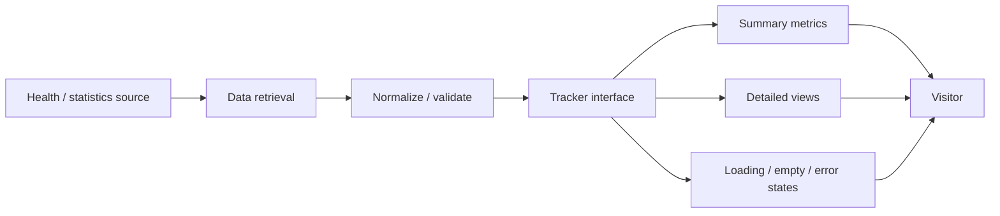
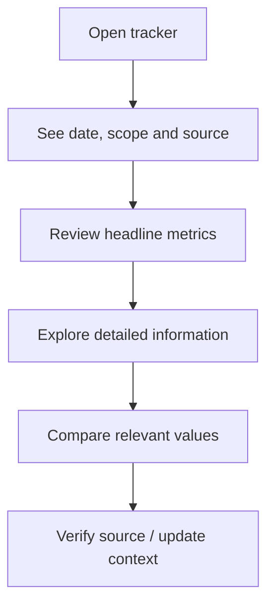
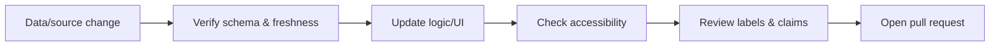

<div align="center">

# Corona Tracker

**A web project for presenting COVID-19 / coronavirus tracking information through a clear, understandable interface.**


[Browse app](./web) · [Issues](https://github.com/Nischhalsubba/corona_tracker/issues)

</div>

## Overview

**Corona Tracker** is a web interface project for organizing and displaying pandemic-related information. The maintained implementation is under `web/`. Because health data can become stale, any deployed version should clearly identify its data source, update time, geographic scope, and limitations.

| Audience | What matters |
|---|---|
| Visitors | Clear numbers, labels, dates, sources and uncertainty |
| Developers | Data retrieval, transformation, rendering and error handling |
| Designers | Legibility, hierarchy, responsive charts/cards and accessible states |
| Reviewers | Source freshness, terminology and responsible presentation |

<details open>
<summary><strong>🏗️ Interactive data architecture</strong></summary>



</details>

## User flow



## Getting started

```bash
git clone https://github.com/Nischhalsubba/corona_tracker.git
cd corona_tracker/web
```

Use the tooling declared by the files inside `web/`. Do not introduce undocumented live-data claims when the project is running from static or historical data.

## Design & data responsibility

Use plain labels, visible timestamps, sufficient contrast, non-color-only distinctions, accessible table alternatives for important charts, and explicit loading/error states. Avoid presenting historical or sample data as current public-health guidance.

## SEO & discoverability

If published, page metadata should accurately describe the geographic scope, time period, data source, and purpose using natural terms such as **COVID-19 tracker, coronavirus statistics, case data, recovery data, and pandemic dashboard** only when those terms match the actual content.

## Contribution flow


