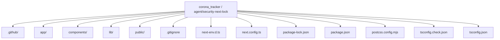
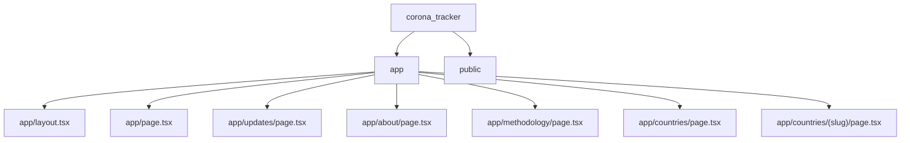
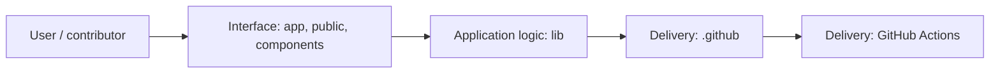
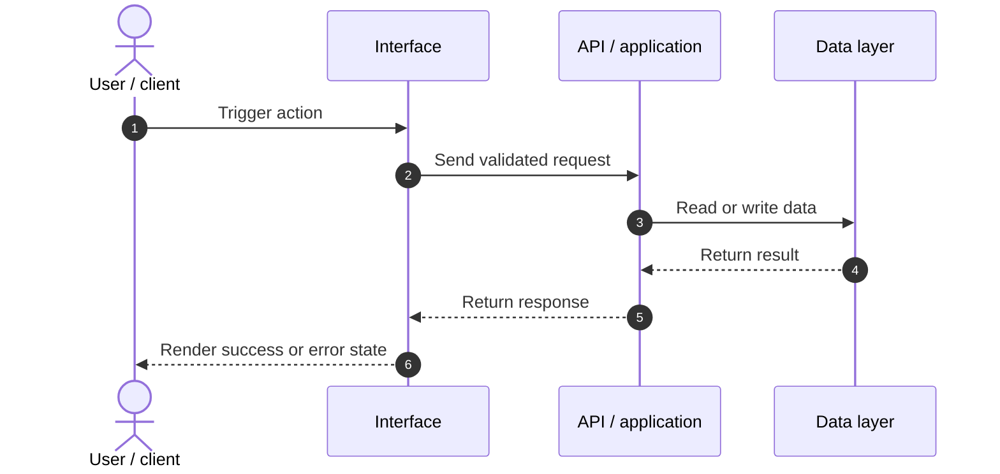
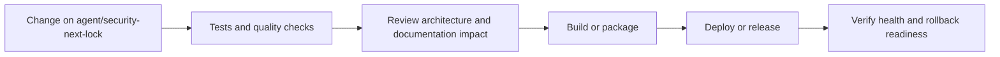
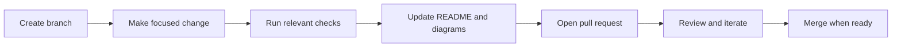

<!-- interactive-readme-standard:start -->

<div align="center">

# corona_tracker

**Branch-aware technical guide for [`agent/security-next-lock`](https://github.com/Nischhalsubba/corona_tracker/tree/agent/security-next-lock)**

<p>       </p>

<p>
  <a href="https://github.com/Nischhalsubba/corona_tracker/tree/agent/security-next-lock"><strong>Browse source</strong></a> ·
  <a href="https://github.com/Nischhalsubba/corona_tracker/issues"><strong>Issues</strong></a> ·
  <a href="https://github.com/Nischhalsubba/corona_tracker/codespaces/new?ref=agent%2Fsecurity-next-lock"><strong>Open in Codespaces</strong></a>
</p>

</div>

> [!IMPORTANT]
> This guide is generated from the files actually present on `agent/security-next-lock`. It links to detected source paths, preserves project-authored notes, and avoids claiming components that were not found.

## At a glance

| Item | Detected value |
|---|---|
| Purpose | A source-aware global COVID-19 reporting dashboard with country pages, historical trends, transparent source metadata, and normalized public-health data feeds. |
| Branch role | Compared with `master` |
| Stack | Next.js, React, Tailwind CSS, TypeScript, JavaScript, CSS |
| Manifests | package.json |
| Prerequisites | Node.js |
| Delivery | GitHub Actions |
| License | No license file detected |

## Branch scope

No branch-specific file differences were detected against the default branch at generation time.


## Quick start

```bash
npm install
npm run dev
npm run start
npm run build
npm run typecheck
```

### Configuration surface

- No committed environment example file was detected.

> Never commit secrets, private keys, production credentials, customer data, or unredacted infrastructure details.

## Repository map



| Responsibility | Detected source paths |
|---|---|
| Interface | [`app`](https://github.com/Nischhalsubba/corona_tracker/tree/agent/security-next-lock/app), [`public`](https://github.com/Nischhalsubba/corona_tracker/tree/agent/security-next-lock/public), [`components`](https://github.com/Nischhalsubba/corona_tracker/tree/agent/security-next-lock/components) |
| Application logic | [`lib`](https://github.com/Nischhalsubba/corona_tracker/tree/agent/security-next-lock/lib) |
| Delivery | [`.github`](https://github.com/Nischhalsubba/corona_tracker/tree/agent/security-next-lock/.github) |

## Website or application map



## Architecture and responsibility flow



<details open>
<summary><strong>Request lifecycle</strong></summary>



Detected API or server areas: [`app/api`](https://github.com/Nischhalsubba/corona_tracker/tree/agent/security-next-lock/app/api).

</details>

## Quality, security, and operations

<table>
<tr>
<td width="33%" valign="top">

### Quality

- No conventional test directory was detected automatically.

Detected commands:
- `npm run dev`
- `npm run start`
- `npm run build`
- `npm run typecheck`

</td>
<td width="33%" valign="top">

### Security

- No dedicated security policy or automated dependency configuration was detected.

Review authentication, authorization, input validation, dependency updates, secret handling, and failure recovery before release.

</td>
<td width="34%" valign="top">

### Observability

- No dedicated observability integration was detected automatically.

Define useful logs, metrics, traces, alerts, and rollback signals for production-facing branches.

</td>
</tr>
</table>

## Delivery flow



### Automation detected

- [`.github/workflows/apply-interactive-readme.yml`](https://github.com/Nischhalsubba/corona_tracker/blob/agent/security-next-lock/.github/workflows/apply-interactive-readme.yml)

## Contribution flow



- Keep changes focused and explain architectural consequences.
- Run the checks relevant to the changed area.
- Update diagrams whenever routes, modules, data models, authentication, jobs, or delivery paths change.
- Add screenshots or recordings for visual behavior changes when useful.
- Use issues for reproducible defects and pull requests for reviewable changes.

## Ownership and support

| Topic | Source |
|---|---|
| Repository | [`Nischhalsubba/corona_tracker`](https://github.com/Nischhalsubba/corona_tracker) |
| Branch | [`agent/security-next-lock`](https://github.com/Nischhalsubba/corona_tracker/tree/agent/security-next-lock) |
| Ownership | No CODEOWNERS file detected |
| Contributing | Use the contribution flow above |
| Support | [Open or review issues](https://github.com/Nischhalsubba/corona_tracker/issues) |
| License | No license file detected |

<details>
<summary><strong>Documentation maintenance checklist</strong></summary>

- [ ] Purpose and branch scope are accurate.
- [ ] Setup and configuration commands still work.
- [ ] Repository, application, API, data, authentication, job, and deployment diagrams match the code.
- [ ] Tests, security controls, observability, and rollback behavior are documented.
- [ ] Links point to real files on this branch.
- [ ] No secrets or private operational details are exposed.

</details>

<!-- interactive-readme-standard:end -->

<!-- project-authored-notes:start -->
<details>
<summary><strong>Project-authored notes preserved from this branch</strong></summary>

# PulseAtlas

PulseAtlas is a public-facing COVID-19 reporting dashboard built with Next.js App Router and TypeScript. It is designed as a source-aware health data product rather than a thin wrapper around a single endpoint, combining live disease.sh reporting with WHO, OWID, and DataHub reference layers through a normalized internal data model.

## What this repo includes

- Live dashboard cards for global totals and current country reporting
- Searchable countries index and shareable country detail pages
- Interactive world map with hover tooltips, search-driven selection, selected-country popup, and zoom controls
- Live reporting notes generated from current country-level changes
- Source visualization for API, CSV, and JSON feeds on the methodology page
- Light and dark themes with persisted user preference
- SEO-ready metadata, sitemap, robots, and crawlable routes

## Source strategy

PulseAtlas uses multiple free public sources, each with a different role:

- `disease.sh`
  - Primary live source for dashboard metrics, rankings, country snapshots, and current updates
- `WHO`
  - Official weekly downloadable CSV layer for fallback and reference validation
- `OWID`
  - Historical archive-oriented CSV and JSON feeds for broader context
- `DataHub`
  - Aggregate and time-series CSV backups for cross-checking and source visibility

## Public routes

- `/`
  Main dashboard
- `/countries`
  Searchable country index
- `/countries/[slug]`
  Country detail view
- `/updates`
  Reporting notes and current update cards
- `/methodology`
  Source catalog, endpoint groups, and feed visualization
- `/about`
  Product scope and limitations

## Internal API routes

- `/api/covid/global`
- `/api/covid/countries`
- `/api/covid/country/[slug]`
- `/api/covid/history/[slug]`
- `/api/covid/sources`
- `/api/covid/updates`

## Technical stack

- `Next.js 16`
- `React 19`
- `TypeScript`
- `Tailwind CSS v4`
- `Zod`
- `d3-dsv`
- `react-svg-worldmap`
- `Recharts`

## Implementation notes

The application uses a backend-for-frontend approach:

- third-party APIs and CSV feeds are fetched server-side
- upstream payloads are normalized into internal app types
- UI components consume stable internal shapes instead of raw external responses
- source metadata is carried into the UI so major data blocks can expose origin and freshness

This keeps the frontend resilient when external schemas drift and makes it easier to add fallback logic or additional feeds without rewriting page components.

## Accessibility and theming

The visual system is tuned around readability and interaction clarity:

- higher-contrast text tokens for headings, labels, and supporting copy
- visible hover and active states across cards, links, and controls
- persistent light and dark theme toggle
- spacing and panel treatment intended to keep dense data scannable
- public-facing views that aim for WCAG-conscious contrast and visibility

## Local development

Install dependencies and start the development server:

```bash
npm install
npm run dev
```

Open `http://localhost:3000`.

## Validation

Run the repo checks with:

```bash
npm run typecheck
npm run build
```

## Deployment

The app is suitable for standard Next.js hosting targets such as Vercel. Set `NEXT_PUBLIC_SITE_URL` if the public hostname changes from the default deployment URL.

</details>
<!-- project-authored-notes:end -->
