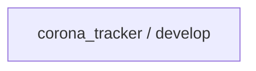
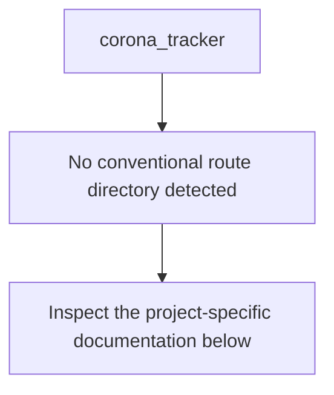
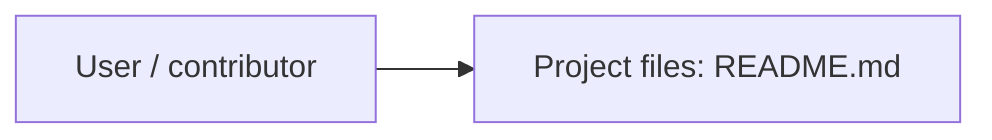
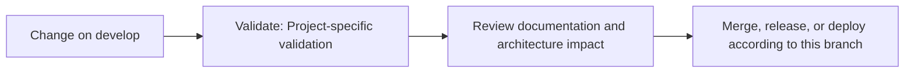

# Corona Tracker

<!-- interactive-readme-standard:start -->

> [!NOTE]
> **Branch-specific documentation:** this section is maintained for [`develop`](https://github.com/Nischhalsubba/corona_tracker/tree/develop). It is generated from the files present on this branch and preserves the project-authored README below.

<details open>
<summary><strong>Interactive repository guide</strong></summary>

## Branch overview

| Item | Value |
|---|---|
| Repository | [`Nischhalsubba/corona_tracker`](https://github.com/Nischhalsubba/corona_tracker) |
| Branch | [`develop`](https://github.com/Nischhalsubba/corona_tracker/tree/develop) |
| Detected stack | No primary framework detected automatically |
| Detected manifests | No standard manifest detected |
| Documentation policy | Every maintained branch must explain purpose, setup, structure, architecture, flows, testing, delivery, security, and ownership. |

## Repository structure



The diagram is generated from the branch's actual top-level files and directories. Use the branch link above for complete source navigation.

## Website or application structure



## Application and responsibility flow



## Change-to-delivery flow



## README requirements for this branch

- Explain what this branch contains and how it differs from the default branch.
- Keep installation, configuration, usage, testing, deployment, security, support, and license information accurate.
- Document repository, website or application, API, data, authentication, background-job, and deployment flows when they exist.
- Prefer Mermaid diagrams and expandable `<details>` sections for visual navigation.
- Link diagrams and modules to real source paths; never invent missing components.
- Preserve project-specific documentation and update diagrams whenever architecture or major paths change.
- Treat secrets, private infrastructure, customer data, and credentials as prohibited README content.

</details>

<!-- interactive-readme-standard:end -->

Landing page design for corona virus tracker

## Getting Started

NA

### Prerequisites

What things you need to install the software and how to install them

```
Node
React
HTML/SCSS/Javscript
```


## Built With

* React
* HTML/SCSS/Javascript


## Developers

* Nihal Shrestha
* Nischhal Raj Subba
